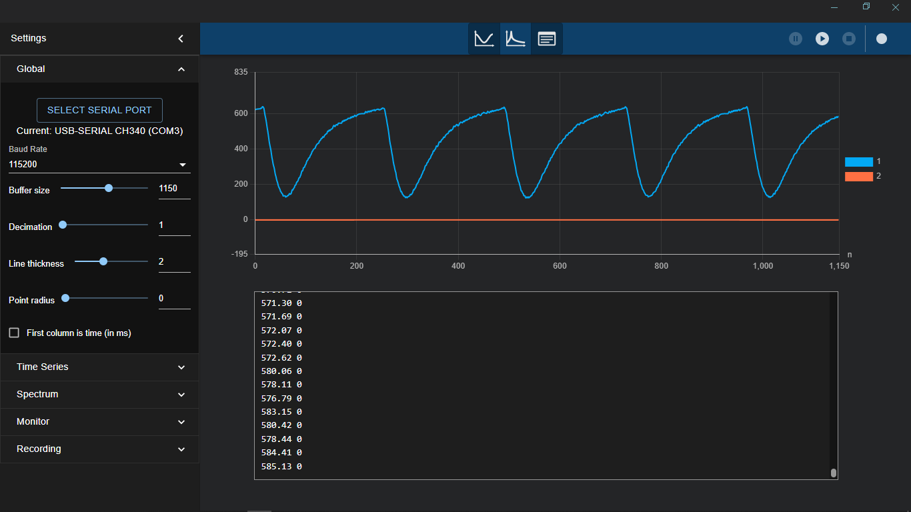
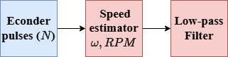

# SpeedEstimator Library for Arduino and ESP32

## Overview

The SpeedEstimator library provides a simple way to calculate motor speed in RPM using encoder pulse data. It is designed to be independent of the data source for position readings, making it versatile for various motor control applications.

Experimental library. Minimal tested, so usage remarks and comments are welcome.

## Features

- Calculates motor speed in RPM based on encoder pulse readings.
- Supports gear ratio adjustments.
- Provides a reset functionality to clear internal states.
- Lightweight and easy to integrate into Arduino projects.

## Installation

1. Copy the `SpeedEstimator.h` and `SpeedEstimator.cpp` files into your Arduino project's `lib/SpeedEstimator_dff/` directory if you are using PlatformIO in VS Code.
2. If you are using the Arduino IDE, copy the files to your Arduino libraries folder (e.g., `C:\Users\<YourUsername>\Documents\Arduino\libraries\SpeedEstimator_dff\`).
3. Alternatively, clone the repository directly into your libraries folder using the following command:

   ```bash
   git clone https://github.com/bulb-light/SpeedEstimator_dff.git <path_to_libraries_folder>
   ```
4. Include the library in your project using `#include <SpeedEstimator.h>`.

## API Reference

### Constructor

```cpp
SpeedEstimator(float ppr, float gearRatio);
```
- `ppr`: Pulses per revolution of the encoder.
- `gearRatio`: Gear ratio of the motor.

### Methods

#### `float estimateSpeed(int pulsesCount)`
Calculates the motor speed in RPM based on the number of encoder pulses.

- `pulsesCount`: The number of pulses counted by the encoder.
- **Returns**: The calculated speed in RPM.

#### `void reset()`
Resets the internal state of the speed estimator.

## Example Usage

Below is an example of using the SpeedEstimator ([SpeedReading.cpp](examples/speedReading.cpp)) library to calculate motor speed. This example demonstrates motor control and speed estimation using encoder pulses:

```cpp
#include <Arduino.h>
#include <util/atomic.h>
#include <SpeedEstimator.h>

// Motor control pins
#define IN1 8
#define IN2 7
#define ENA 10

// Encoder pins
#define ENCA 3
#define ENCB 2

// Encoder parameters
float ppr = 22.0; // Pulses per revolution
float gearRatio = 9.3; // Gear ratio
SpeedEstimator speedEstimator(ppr, gearRatio);

// Global variables: Encoder counter
volatile int pos_i = 0;

// Method to read encoder pulses
void readEncoderPulses();

void setup() {
    Serial.begin(115200);
    speedEstimator.reset();

    // Motor control pins
    pinMode(IN1, OUTPUT);
    pinMode(IN2, OUTPUT);
    pinMode(ENA, OUTPUT);

    // Motor setup: Move motor
    digitalWrite(IN1, HIGH);
    digitalWrite(IN2, LOW);
    analogWrite(ENA, 0); // Set speed (0-255)

    // Setting up encoder interrupts
    attachInterrupt(digitalPinToInterrupt(ENCA), readEncoderPulses, RISING);
    attachInterrupt(digitalPinToInterrupt(ENCB), readEncoderPulses, RISING);
}

void loop() {
    long elapsed = millis();
    int speedValue = (elapsed / 10) % 256; // Speed value between 0-255
    analogWrite(ENA, speedValue);

    int currentPulses;
    ATOMIC_BLOCK(ATOMIC_RESTORESTATE) {
        currentPulses = pos_i;
    }

    float speed = speedEstimator.estimateSpeed(currentPulses);

    Serial.print("Motor Speed: ");
    Serial.print(speed);
    Serial.print(" ");
    Serial.println(0);

    delay(10);
}

void readEncoderPulses() {
    pos_i++;
}
```

The result of the example is shown in the following figure (the blue line represents the variable speed in RPM):

<p align="center">
    
</p>

### Diagram

Refer to the following diagram for the wiring connections:

<p align="center">

</p>

### Note

- The encoder pulse counter (`pos_i` in the example) must be implemented with independent logic to ensure accurate pulse counting. This is critical for maintaining consistent speed estimation, especially in high-speed applications. The logic should handle interrupts and avoid conflicts with other processes in the microcontroller.

## Important Notes

- **Critical Note**: The library requires an external encoder counter to provide the `pulsesCount` parameter to the `estimateSpeed` function (as shown in the [block diagram](images/speed_reading_connections.svg)). If the `pulsesCount` remains constant, the library cannot estimate the speed, as it relies on changes in the pulse count over time to calculate velocity.
- The `estimateSpeed` method includes a hardcoded filter for smoothing speed calculations. This may limit the library's effectiveness for high-speed motors or applications requiring rapid response times.
- The hardcoded filter in `estimateSpeed` is designed for a sampling time of 0.01 seconds and implements a first-order Butterworth (IIR) filter. Adjustments may be required for different sampling times or filtering requirements.
- Ensure that the `estimateSpeed(int pulsesCount)` method is called at regular intervals to maintain accurate speed calculations.
- Contributions to improve the library, such as making the filter configurable, are highly encouraged. Feel free to submit pull requests or open issues on the GitHub repository.

## Mathematical Background

The SpeedEstimator library calculates motor speed in RPM using encoder pulse data. The following equations outline the mathematical process:

1. **Angular Velocity Calculation**:

   $$\omega = \frac{\Delta N}{\Delta t} \cdot \frac{2\pi}{PPR}$$
   
   where:
   - $\Delta N$: Change in encoder pulse count
   - $\Delta t$: Time interval between readings
   - $PPR$: Pulses per revolution of the encoder

3. **Speed in RPM**:

   $$\text{Speed (RPM)} = \omega \cdot \frac{60}{2\pi} \cdot \frac{1}{\text{Gear Ratio}}$$

4. **Filtering**:
   The library applies a first-order Butterworth filter to smooth the speed estimation:
   
   $$S_{filtered} = a \cdot S_{filtered,prev} + b \cdot S_{current} + c \cdot S_{prev}$$
   
   where:
   - $a, b, c$: Filter coefficients
   - $S_{filtered,prev}$: Previous filtered speed
   - $S_{current}$: Current calculated speed
   - $S_{prev}$: Previous calculated speed

### Block Diagram

Below is a simple block diagram representing the speed estimation and filtering process:

<p align="center">

</p>

This process ensures accurate and smooth speed estimation for motor control applications.

## License

This library is open-source and available under the MIT License.

---

## 📫 How to Reach Me

| Platform | Handle / Link |
|---|---|
| Email | davidcs.ee.10@gmail.com |
| LinkedIn | [david](https://www.linkedin.com/in/davidcsee/) |
| Tiktok | [david_dff_bulblight](https://www.tiktok.com/@david_dff_bulblight)|
| YouTube| [david-dff](https://www.youtube.com/@david-dff-bulblight)|

---

## 🔗 Connect & Collaborate

I’m open to collaboration on open source, side projects, or mentoring.  
Feel free to reach out!

If you appreciate my work, you can support its development and maintenance. Improve the quality of the libraries by providing issues and Pull Requests, or make a donation.

Thank you.
